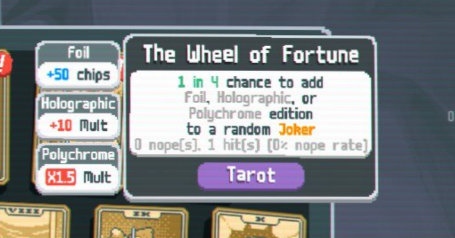

# Wheel of Fortune Tracker + Guarantee

This mod for Balatro will either:

- Track your Nope! rate for The Wheel of Fortune, adding metrics to the card display, or
- Guarantee the "1 in 4" success rate for The Wheel of Fortune, such that The Wheel cannot Nope! you more than 3 times in a row

The metrics will no longer reset when Balatro.exe launches and will be saved between sessions.

Tracker mode:

Guarantee mode:

Refer to [PityWheel.lua](PityWheel.lua) for configuration details and usage hints.

## Installation

1. Install [Steammodded](https://github.com/Steamopollys/steamodded)
2. Put PityWheel.lua into your Mods folder
3. Put wheel_save.txt in your `%appdata%/Balatro` folder
4. Modify the config section at the top of PityWheel.lua according to your preferences
